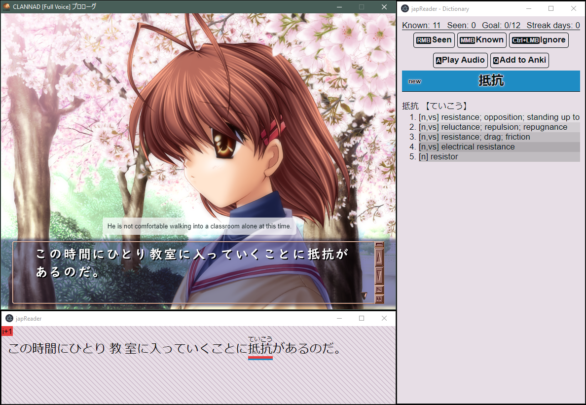
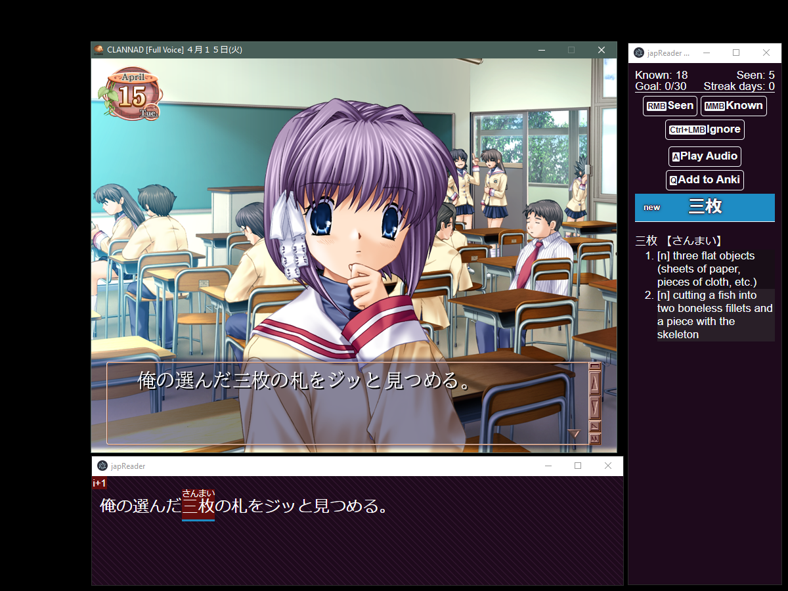
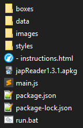

# japReader

##### An Electron app that helps you read Japanese text. 
##### (Only tested for Windows 10)

###### Version 1.2 created by [seth-js](https://github.com/seth-js)
###### Versions 1.3+ (this repo) forked by [marisukukise](https://github.com/marisukukise)

# Examples
  

# Currently Supported
VNs, LNs, TV Shows/Movies

# Features
* Parser and dictionary from [ichi.moe](https://ichi.moe/cl/qr/?q=&r=kana)
* Word status tracking
* DeepL translations (no bullshit limits)
* One-click Anki sentence/word card creation
* Furigana support

# How does this work?
* It watches your clipboard for Japanese text. Once Japanese text is detected, it gets parsing and dictionary data from [ichi.moe](https://ichi.moe/cl/qr/?q=&r=kana).
* The word status tracking is done by checking each parsed dictionary form of a word against a small collection of word databases that accumulate as you use the program.
* The Anki feature uses the [AnkiConnect](https://github.com/FooSoft/anki-connect) API to send over the necessary card data.

# How do I set this up?
1. Download and extract `japReader.zip`.
2. You should have all the files as shown in this image:

3. Then, you need to install Node.js:
-   Windows and macOS users can install it from
    [here](https://nodejs.org/en/download/).
-   Linux instructions can be found
    [here](https://nodejs.org/en/download/package-manager/).
4. Once you have Node.js installed, you should navigate to the folder where you extracted japReader.
-   Windows users: Open: `run.bat`
-   Linux and macOS users: Open the terminal and navigate to the japReader folder using `cd` Enter `npm install; npm start`
5. The program will now open.

# Keybindings
`O` - Options (open options menu)  
`S` - Toggle Stay On Top  
`H` - Toggle Transparent Translation Window (when transparent translation window is focused)  
`A` - Play Audio  
`Q` - Add to Anki  
`RMB` - (in reader) Change word status to Seen  
`MMB` - (in reader) Change word status to Known  
`Ctrl+LMB` - (in reader) Change word status to Ignored

# How do I read VNs with this?
1.  Download and install a Japanese VN
2.  Download, install, and open
    [Textractor](https://github.com/Artikash/Textractor)
3.  Open the VN
4.  Hook the text
5.  Open japReader

# How do I read LNs/Ebooks with this?
1.  Open your LN/Ebook
2.  Open japReader
3.  If you can, highlight and copy a few sentences from the LN/Ebook

# How do I watch Drama/Movies/Anime with this?
1.  Get a local copy of the show/movie that you want to watch
2.  Get the Japanese subtitles for what you want to watch
3.  Download [mpv](https://mpv.io/)
4.  Download and install
    [this](https://github.com/Ben-Kerman/mpv-sub-scripts) plugin and
    [this](https://github.com/perogiue/mpv-scripts) plugin for mpv
5.  Open the video with mpv
6.  Switch to Japanese subtitles with the J key
7.  Press the \* key (shift+8) to automatically copy subtitles to your
    clipboard
8.  Press the N key to pause at the end of each subtitle line
9.  Open japReader

# How do I get Anki card creation to work?
1.  Install [Anki](https://apps.ankiweb.net/)
2.  Install the [AnkiConnect
    addon](https://ankiweb.net/shared/info/2055492159)
3.  Open `japReader.apkg`
4.  Ensure that the deck is named `japReader`
5.  Click `Add to Anki` in the Dictionary window, and card data should
    be generated for the `japReader` Anki deck

# QA and Notes
Q: Why does the text \"i+1\" keep showing?  
A: When the the text \"i+1\" shows up, that means there is only one unknown word in the sentence. This is perfect for sentence/vocab Anki cards.

Q: Why does the translation text dim sometimes?  
A: This happens when there is only one unknown word in the sentence. You should hopefully be able to not depend on the translation.

Q: I don\'t like a feature, is there any way I can turn it off?  
A: Press `O` while one of the windows is in focus. The options menu will open up. All settings can be modified from there.