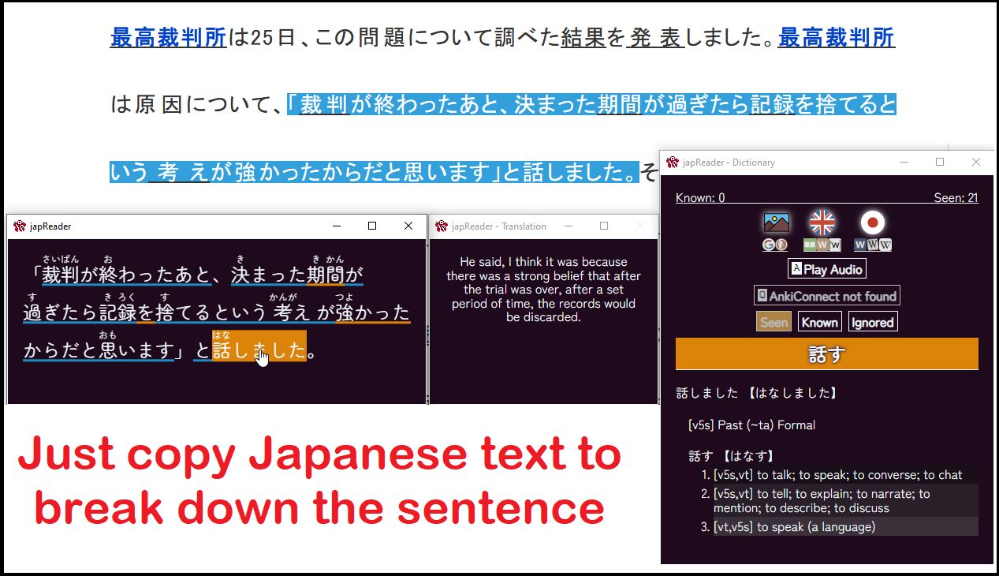
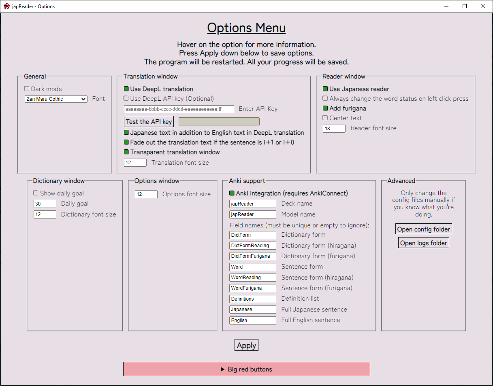

#  japReader
## App that makes reading Japanese easy

- [ japReader](#-japreader)
  - [App that makes reading Japanese easy](#app-that-makes-reading-japanese-easy)
- [ Preview](#-preview)
  - [Examples](#examples)
  - [Currently Supported](#currently-supported)
  - [Features](#features)
- [ Installation](#-installation)
  - [Windows](#windows)
  - [Linux](#linux)
- [  Build](#--build)
- [ Technical information](#-technical-information)
  - [Configuration files](#configuration-files)
  - [How to migrate data from old japReader](#how-to-migrate-data-from-old-japreader)
- [ Controls](#-controls)
  - [Keybindings](#keybindings)
  - [Mouse buttons](#mouse-buttons)
- [ FAQ](#-faq)
  - [How does this work?](#how-does-this-work)
  - [How do I read VNs with this?](#how-do-i-read-vns-with-this)
  - [How do I read LNs/Ebooks with this?](#how-do-i-read-lnsebooks-with-this)
  - [How do I watch Drama/Movies/Anime with this?](#how-do-i-watch-dramamoviesanime-with-this)
  - [How do I get Anki card creation to work?](#how-do-i-get-anki-card-creation-to-work)
  - [I can't press a button / something doesn't work](#i-cant-press-a-button--something-doesnt-work)
  - [Why does the text "i+1" keep showing?](#why-does-the-text-i1-keep-showing)
  - [Why does the translation text dim sometimes?](#why-does-the-translation-text-dim-sometimes)
  - [I don't like a feature, is there any way I can turn it off?](#i-dont-like-a-feature-is-there-any-way-i-can-turn-it-off)
- [ Credits](#-credits)

#  Preview
## Examples

## Currently Supported
VNs, LNs, TV Shows/Movies

## Features
* Parser and dictionary from [ichi.moe](https://ichi.moe/cl/qr/?q=&r=kana)
* Word status tracking
* DeepL translations (no bullshit limits)
* One-click Anki sentence/word card creation
* Furigana support

#  Installation
## Windows
1. Go to [latest release](https://github.com/marisukukise/japReader/releases/latest)
2. Download a file like `japreader-x.y.z.Setup.exe`
3. Run it. The .exe is not signed, so there might be some warnings. 

Alternatively, if you don't want to install, you can download the .zip package:
1. Go to [latest release](https://github.com/marisukukise/japReader/releases/latest)
2. Download a file like `japreader-win32-x64-x.y.z.zip`
3. Extract it and run with `japreader.exe`

## Linux
1. Go to [latest release](https://github.com/marisukukise/japReader/releases/latest)
2. Download a file matching your distribution
3. Install the file using your package manager and sudo version

If there is no package available for your distribution, you may try 
downloading the `japreader-linux-x64-x.y.z.zip` file and running `./japreader`,
however it's less reliable (it didn't work for me on Fedora Linux, but .rpm package does)
If none of the above works, you can try [Building](#--build) the program yourself.

> **_NOTE:_** It may happen that your clipboard reading will not work on Linux

> I did fix it and it works for me fresh out of install right now, but maybe it will be different
> on other distributions. If this is the case, you should go to the install directory of japreader
> (you can check the location using `whereis japreader`), and then run the command
> `sudo chmod 777 node_modules/clipboard-event/platform/clipboard-event-handler-linux`
> in the app's directory. It is a C program reading clipboard, and it needs execution permissions. 
> This should be automatically set, but maybe for some reason it isn't.
> Then you will be able to run a program that monitors change in your clipboard.
> If you did this and it still doesn't work, please open an issue.

#   Build
1. Download [node.js](https://nodejs.org/en/download/)
2. Clone the repository: `git clone https://github.com/marisukukise/japReader.git`
3. Navigate into it `cd japReader`
4. Install dependencies `npm i`
5. If you're on Linux, run `sudo chmod 777 node_modules/clipboard-event/platform/clipboard-event-handler-linux`, 
   if you're on Windows ignore this point
6. Build files `npm run make`
7. The files will be output in `out/make/<your_platform>/x64` folder

If you want to run this without installing, in point 6. of [Build](#Build) you can instead run the program using `npm start`

#  Technical information
## Configuration files

Configuration files are stored in:

| OS      	| Configuration files path                                            	|
|---------	|---------------------------------------------------------------------	|
| Windows 	| `%APPDATA%/japreader/config`                                        	|
|   Linux 	| `$XDG_CONFIG_HOME/japreader/config` or `~/.config/japreader/config` 	|

Although it's not recommended to change anything there, 
you can do everything that was intended through GUI in the options menu

## How to migrate data from old japReader

1. Backup your old data in case something goes wrong
2. Open side by side: the [configuration files](#configuration-files) folder and the old configuration folder `data` in pre-1.5 japReader in the install location.
3. Open the corresponding files one by one (e.g. `status_data.json`) and paste the data to fit the new template
4. You'll get it eventually I believe in you

#  Controls
## Keybindings
- `O` Open Options Menu 
- `S` Toggle Stay On Top  
- `H` (in Translation Window) Toggle Transparent Translation Window
- `A` (in Dictionary) Play Audio  
- `Q` (in Dictionary) Add to Anki  

## Mouse buttons
In the Reader window you can quickly change the status of a word with mouse buttons:
- `LMB` set to Seen
- `RMB` set to Known
- `Ctrl+LMB` set to Ignored

#  FAQ
## How does this work?
* It watches your clipboard for Japanese text. Once Japanese text is detected, it gets parsing and dictionary data from [ichi.moe](https://ichi.moe/cl/qr/?q=&r=kana).
* The word status tracking is done by checking each parsed dictionary form of a word against a small collection of word databases that accumulate as you use the program.
* The Anki feature uses the [AnkiConnect](https://github.com/FooSoft/anki-connect) API to send over the necessary card data.

## How do I read VNs with this?
1.  Download and install a Japanese VN
2.  Download, install, and open
    [Textractor](https://github.com/Artikash/Textractor)
3.  Open the VN
4.  Hook the text
5.  Open japReader

## How do I read LNs/Ebooks with this?
1.  Open your LN/Ebook (I can recommend https://reader.ttsu.app/)
2.  Open japReader
3.  If you can, highlight and copy a few sentences from the LN/Ebook

## How do I watch Drama/Movies/Anime with this?
1.  Get a local copy of the show/movie that you want to watch
2.  Get the Japanese subtitles for what you want to watch
3.  Download [mpv](https://mpv.io/)
4.  Download and install
    [this](https://github.com/Ben-Kerman/mpv-sub-scripts) plugin and
    [this](https://github.com/perogiue/mpv-scripts) plugin for mpv
5.  Open the video with mpv
6.  Switch to Japanese subtitles with the J key
7.  Press the \* key (shift+8) to automatically copy subtitles to your
    clipboard
8.  Press the N key to pause at the end of each subtitle line
9.  Open japReader

## How do I get Anki card creation to work?
1.  Install [Anki](https://apps.ankiweb.net/)
2.  Install the [AnkiConnect
    addon](https://ankiweb.net/shared/info/2055492159)
3.  Download [`Anki_japReader.apkg`](https://github.com/marisukukise/japReader/releases/latest) 
    and open it
4.  Ensure that the deck is named `japReader`
5.  Click `Add to Anki` in the Dictionary window, and card data should
    be generated for the `japReader` Anki deck

## I can't press a button / something doesn't work
If something doesn't work, and the buttons to reset the options can't be clicked (this sometimes happens on program update, when old settings remain), then before opening the issue you should try to:
1. Go to your [configuration files](#configuration-files)
2. Delete the files `options.json` and `window_settings.json`
This will keep your word data, but will just reset the options to default

If this still doesn't work, then something might be wrong with cache from old versions, in which case you should delete the entire japReader folder (one step up the [configuration folder](#configuration-files)). But remember to backup your config folder before, because it contains your seen/known/etc data.

## Why does the text \"i+1\" keep showing?  
When the the text \"i+1\" shows up, that means there is only one unknown word in the sentence. This is perfect for sentence/vocab Anki cards.

## Why does the translation text dim sometimes?  
This happens when there is only one unknown word in the sentence. You should hopefully be able to not depend on the translation.

## I don\'t like a feature, is there any way I can turn it off?  
Press `O` while one of the windows is in focus. The options menu will open up. All settings can be modified from there.

#  Credits
This repo was forked from japReader 1.2 created by [seth-js](https://github.com/seth-js)
