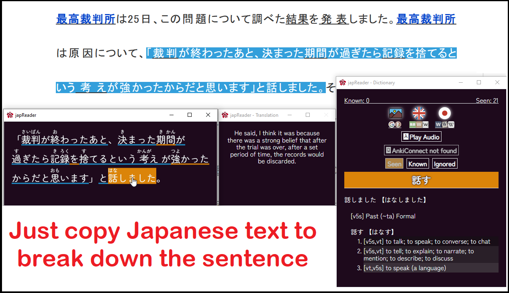
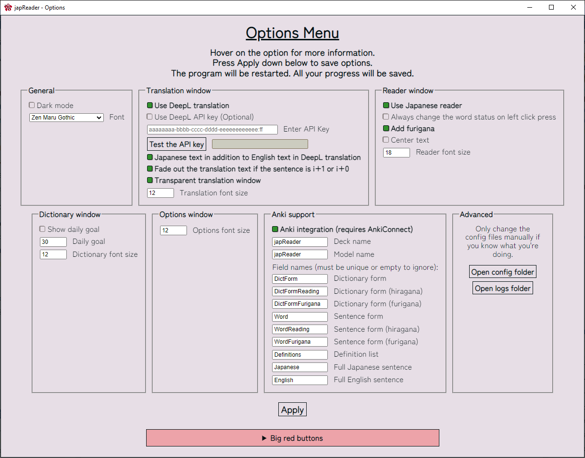

#  japReader
japReader is an app for breaking down Japanese sentences and tracking vocabulary progress. Built with simplicity in mind.

Originally developed by [seth-js](https://github.com/seth-js).

#  Preview

<!-- TOC -->
#  Table of Contents
- [japReader](#-japreader)
- [Preview](#-preview)
- [Table of Contents](#-table-of-contents)
- [Features](#-features)
- [Installation](#-installation)
    - [Windows](#windows)
    - [Linux](#linux)
    - [macOS](#macos)
- [Build](#-build)
- [Technical information](#-technical-information)
    - [Configuration files](#configuration-files)

- [Controls](#-controls)
    - [Keybindings](#keybindings)
    - [Mouse buttons](#mouse-buttons)
- [FAQ](#-faq)
    - [How does this work?](#how-does-this-work)
    - [How do I read VNs with this?](#how-do-i-read-vns-with-this)
    - [How do I read LNs/Ebooks with this?](#how-do-i-read-lnsebooks-with-this)
    - [How do I read manga with this?](#how-do-i-read-manga-with-this)
    - [How do I watch Drama/Movies/Anime with this?](#how-do-i-watch-dramamoviesanime-with-this)
    - [How do I get Anki note creation to work?](#how-do-i-get-anki-note-creation-to-work)
    - [I can't press a button / something doesn't work](#i-cant-press-a-button--something-doesnt-work)
    - [Whoes the text \"i+1\" keep showing?  ](#why-does-the-text-i1-keep-showing--)
    - [Why does the translation text dim sometimes?  ](#why-does-the-translation-text-dim-sometimes--)
    - [I don\'t like a feature, is there any way I can turn it off?  ](#i-dont-like-a-feature-is-there-any-way-i-can-turn-it-off--)
<!-- /TOC -->

#  Features
* Parser and dictionary from [ichi.moe](https://ichi.moe/cl/qr/?q=&r=kana)
* Furigana
* Translation history
* Word status tracking
* DeepL translations
* One-click Anki sentence/word card creation

#  Installation
### <ins>Windows</ins>
1. Go to [latest release](https://github.com/marisukukise/japReader/releases/latest)
2. Download a file like `japreader-x.y.z.Setup.exe`
3. Run it. The .exe is not signed, so there might be some warnings. 

Alternatively, if you don't want to install, you can download the .zip package:
1. Go to [latest release](https://github.com/marisukukise/japReader/releases/latest)
2. Download a file like `japreader-win32-x64-x.y.z.zip`
3. Extract it and run with `japreader.exe`

### <ins>Linux</ins>
1. Go to [latest release](https://github.com/marisukukise/japReader/releases/latest)
2. Download a file matching your distribution (`.deb`, `.rpm`, or `.zip`)
3. Install the file using your package manager

### <ins>macOS</ins>
1. Go to [latest release](https://github.com/marisukukise/japReader/releases/latest)
2. Download the `.dmg` or `.zip` file
3. Open the `.dmg` and drag the app to Applications, or extract the `.zip` and run the app

#  Build
<ol>
  <li>
    Download and install <a href="https://nodejs.org/en/download/">node.js</a>
  </li>
  <li>
    Clone the repository <code>git clone https://github.com/marisukukise/japReader.git</code>
  </li>
  <li>
    Navigate into it <code>cd japReader</code>
  </li>
  <li>
    Install dependencies <code>npm i</code>
  </li>
  <li> 
    Add execution permissions to the file reading the clipboard:  
    <i>For Windows</i>: Ignore this point, it already has permissions  
    <i>For Linux</i>: <code>sudo chmod 777 node_modules/clipboard-event/platform/clipboard-event-handler-linux</code> 
    <i>For MacOS</i>: <code>chmod 777 node_modules/clipboard-event/platform/clipboard-event-handler-mac</code></li>
  <li> Build files <code>npm run make</code></li>
  <li> The built files will be output in <code>out/make/</code> folder</li>
</ol>

If you want to run this without installing, in point 6. of [Build](#Build) you can instead run the program using `npm start`

#  Technical information
### <ins>Configuration files</ins>

Configuration files are stored in:

| OS      | Configuration files path                                            |
|---------|---------------------------------------------------------------------|
| Windows | `%APPDATA%/japreader/config`                                        |
| Linux   | `$XDG_CONFIG_HOME/japreader/config` or `~/.config/japreader/config` |
| macOS   | `~/Library/Application Support/japreader/config`                    |

Although it's not recommended to change anything there, 
you can do everything that was intended through GUI in the options menu

#  Controls
### <ins>Keybindings</ins>
- `O` Open Options Menu 
- `S` Toggle Stay On Top  
- `H` (in Translation Window) Toggle Transparent Translation Window
- `A` (in Dictionary) Play Audio  
- `Q` (in Dictionary) Add to Anki  

### <ins>Mouse buttons</ins>
In the Reader window you can quickly change the status of a word with mouse buttons:
- `LMB` set to Seen
- `RMB` set to Known
- `Ctrl+LMB` set to Ignored

#  FAQ
### <ins>How does this work?</ins>
* It watches your clipboard for Japanese text. Once Japanese text is detected, it gets parsing and dictionary data from [ichi.moe](https://ichi.moe/cl/qr/?q=&r=kana).
* **Note:** Clipboard watching on Linux currently only works on X11, not Wayland.
* The word status tracking is done by checking each parsed dictionary form of a word against a small collection of word databases that accumulate as you use the program.
* The Anki feature uses the [AnkiConnect](https://github.com/FooSoft/anki-connect) API to send over the necessary card data.

### <ins>How do I read VNs with this?</ins>
Use [Textractor](https://github.com/Artikash/Textractor) with "Copy to Clipboard" extension.

### <ins>How do I read LNs/Ebooks with this?</ins>
Just copy some Japanese text from your book.

### <ins>How do I read manga with this?</ins>
Use an OCR tool that copies detected text to your clipboard, which japReader will pick up automatically.

__Windows:__ [Cloe](https://github.com/blueaxis/Cloe) - a simple and minimalistic screen OCR tool.

__Linux/macOS:__ You can try [mokuro](https://github.com/kha-white/mokuro) or other OCR tools that copy text to clipboard.

### <ins>How do I watch Drama/Movies/Anime with this?</ins>
For video media, there are probably better ways to get a Japanese dictionary
than japReader, but you can try using japReader too.
1.  Download [mpv](https://mpv.io/)
2.  Download and install
    [this](https://github.com/Ben-Kerman/mpv-sub-scripts) plugin and
    [this](https://github.com/perogiue/mpv-scripts) plugin for mpv
3.  Open the video with mpv
4.  Switch to Japanese subtitles with the J key
5.  Press the \* key (shift+8) to automatically copy subtitles to your
    clipboard
6.  Press the N key to pause at the end of each subtitle line

### <ins>How do I get Anki note creation to work?</ins>
1.  Install [Anki](https://apps.ankiweb.net/)
2.  Install the [AnkiConnect
    addon](https://ankiweb.net/shared/info/2055492159)
3. Fill in the Anki deck information in the Options menu (press `O` to open it)
4.  Click `Add to Anki` in the Dictionary window, and an anki note should be added to your Anki deck

If you don't want to configure anything, you can download 
[`Anki_japReader.apkg`](https://github.com/marisukukise/japReader/releases/latest) 
and load it to Anki. The default settings are preconfigured for this deck.

### <ins>I can't press a button / something doesn't work</ins>
If something doesn't work, and the buttons to reset the options can't be clicked (this sometimes happens on program update, when old settings remain), then before opening the issue you should try to:
1. Go to your [configuration files](#configuration-files)
2. Delete the files `options.json` and `window_settings.json`
This will keep your word data, but will just reset the options to default

If this still doesn't work, then something might be wrong with cache from old versions, in which case you should delete the entire japReader folder (one step up the [configuration folder](#configuration-files)). But remember to backup your `config/status_data.json` file before, because it contains your seen/known/etc data.

### <ins>Why does the text \"i+1\" keep showing?  </ins>
When the the text \"i+1\" shows up, that means there is only one unknown word in the sentence. This is perfect for sentence/vocab Anki cards.

### <ins>Why does the translation text dim sometimes?  </ins>
This happens when there is only one unknown word in the sentence. You should hopefully be able to not depend on the translation. 
But you can turn this feature off.

### <ins>I don\'t like a feature, is there any way I can turn it off?  </ins>
Press `O` while one of the windows is in focus. The options menu will open up. All settings can be modified from there.