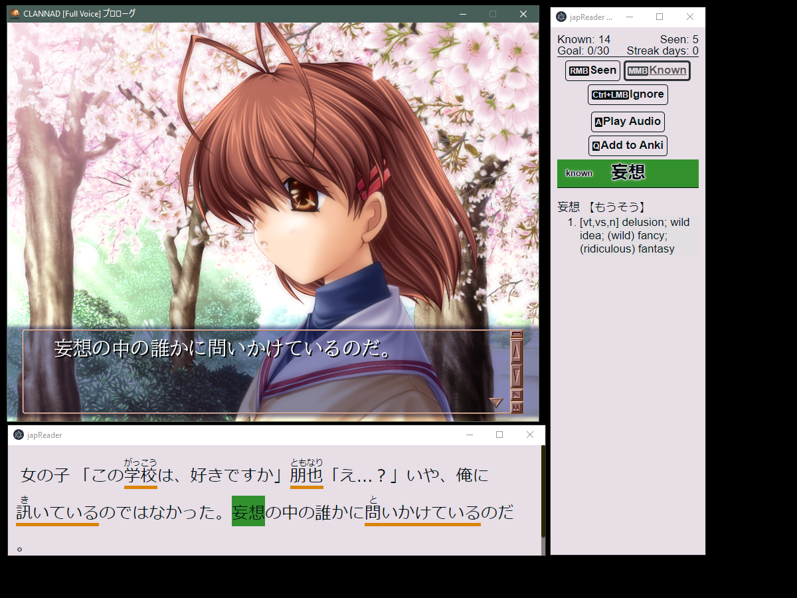

japReader 1.3.1
===============

#### An Electron app that helps you read Japanese text.

##### Version 1.2 created by [seth-js](https://github.com/seth-js).

##### Version 1.3 forked by me

### Rough changelog:

------------------------------------------------------------------------

1.  **1.3.0** Added the ability to change the status of a word with
    mouse buttons:
    -   Seen: Right Mouse Button
    -   Known: Middle Mouse Button
    -   Ignore: Ctrl + Left Mouse Button
2.  Changed the method of adding a word to Anki. Now it is added in the
    background, and a pop-up window doesn\'t show anymore.
3.  Added shortcuts for playing audio and adding the word to Anki:
    -   Play audio: A
    -   Add to Anki: Q
4.  ~~Changed the appearance to (hopefully) more intuitive colors~~
5.  **1.3.1 Hotfix** Restyled everything because in 1.3.0 the contrast
    was too random and some things were hard to read.

### Examples

### Did you use japReader 1.1? If so, click [here](#returning-users).

### Currently Supported

------------------------------------------------------------------------

#### VNs, LNs, TV Shows/Movies

### Features

------------------------------------------------------------------------

#### Parser and dictionary from [ichi.moe](https://ichi.moe/cl/qr/?q=&r=kana)

#### Word status tracking

#### DeepL translations (no bullshit limits)

#### One-click Anki sentence/word card creation

#### Furigana support

### How does this work?

------------------------------------------------------------------------

#### It watches your clipboard for Japanese text. Once Japanese text is detected, it gets parsing and dictionary data from [ichi.moe](https://ichi.moe/cl/qr/?q=&r=kana).

#### The word status tracking is done by checking each parsed dictionary form of a word against a small collection of word databases that accumulate as you use the program.

#### The Anki feature uses the [AnkiConnect](https://github.com/FooSoft/anki-connect) API to send over the necessary card data.

### How do I set this up?

------------------------------------------------------------------------

#### You\'re reading this right now which means you\'ve already extracted `japReader-1.3.1.zip`.

#### You should have all the files as shown in this image:

#### First, you need to install Node.js:

-   Windows and macOS users can install it from
    [here](https://nodejs.org/en/download/).
-   Linux instructions can be found
    [here](https://nodejs.org/en/download/package-manager/).

#### Once you have Node.js installed, you should navigate to the folder where you extracted japReader.

#### Windows users: Open: `run.bat`

#### Linux and macOS users: Open the terminal and navigate to the japReader folder using `cd` Enter `npm install; npm start`

#### The program will now open.

### Note for Linux users

------------------------------------------------------------------------

#### Due to an unfixed bug with Electron, windows don\'t hide like I intended them to.

#### The windows can be minimized manually, and the program will still function normally.

### Keybindings

------------------------------------------------------------------------

#### O - Options (open options menu)

#### S - Toggle Stay On Top

#### H - Toggle Transparent Translation Window (when transparent translation window is focused)

#### A - Play Audio

#### Q - Add to Anki

#### RMB - (in reader) Change word status to Seen

#### MMB - (in reader) Change word status to Known

#### Ctrl+LMB - (in reader) Change word status to Ignored

### How do I read VNs with this?

------------------------------------------------------------------------

1.  Download and install a Japanese VN
2.  Download, install, and open
    [Textractor](https://github.com/Artikash/Textractor)
3.  Open the VN
4.  Hook the text
5.  Open japReader

### How do I read LNs/Ebooks with this?

------------------------------------------------------------------------

1.  Open your LN/Ebook
2.  Open japReader
3.  If you can, highlight and copy a few sentences from the LN/Ebook

### How do I watch Drama/Movies/Anime with this?

------------------------------------------------------------------------

1.  Get a local copy of the show/movie that you want to watch
2.  Get the Japanese subtitles for what you want to watch
3.  Download [mpv](https://mpv.io/)
4.  Download and install
    [this](https://github.com/Ben-Kerman/mpv-sub-scripts) plugin and
    [this](https://github.com/perogiue/mpv-scripts) plugin for mpv
5.  Open the video with mpv
6.  Switch to Japanese subtitles with the J key
7.  Press the \* key (shift+8) to automatically copy subtitles to your
    clipboard
8.  Press the N key to pause at the end of each subtitle line
9.  Open japReader

### How do I get Anki card creation to work?

------------------------------------------------------------------------

1.  Install [Anki](https://apps.ankiweb.net/)
2.  Install the [AnkiConnect
    addon](https://ankiweb.net/shared/info/2055492159)
3.  Open `japReader1.3.1.apkg`
4.  Ensure that the deck is named `japReader`
5.  Click `Add to Anki` in the Dictionary window, and card data should
    be generated for the `japReader` Anki deck

### The Goal feature

------------------------------------------------------------------------

#### Your goal count goes up when you mark a `new` word as `seen`.

### About Fonts

------------------------------------------------------------------------

#### I\'ve changed the font styling of japReader a bit since 1.1.

#### If you want the fonts to look like the screenshots at the top of this page:

1.  (Windows) Install [MacType](https://github.com/snowie2000/mactype)
2.  Download and install [these
    fonts](https://www.mediafire.com/file/j6nnrwp9zcfmc8a/japReader+1.2+Fonts.zip/file)
3.  Open japReader

### QA and Notes

------------------------------------------------------------------------

#### Q: Why does the text \"i+1\" keep showing?

#### A: When the the text \"i+1\" shows up, that means there is only one unknown word in the sentence. This is perfect for sentence/vocab Anki cards.

#### Q: Why does the translation text dim sometimes?

#### A: This happens when there is only one unknown word in the sentence. You should hopefully be able to not depend on the translation.

#### Q: I don\'t like a feature, is there any way I can turn it off?

#### Press `O` while one of the windows is in focus. The options menu will open up. All settings can be modified from there.

#### I\'ll be checking the /vg/ archive for mentions of \"japReader\" every once in a while. If you have any feature suggestions or problems, I should be able to see it.

#### Thanks to everyone who gave me ideas, bug reports, and words of encouragement since 1.1.

### Returning Users 
### (not tested for 1.3.1, but nothing has changed in the structure of the files so the instructions are likely the same)

------------------------------------------------------------------------

#### A lot has changed since 1.1 of japReader. Most of the code has been rewritten. The Anki deck has been upgraded, and word tracking is now done differently.

### How to transfer 1.1 word data to 1.2:

1.  Open your japReader 1.1 folder
2.  Copy all files that start with `data_`
3.  Navigate to your japReader 1.2 folder
4.  Paste the files in `data/transfer/`
5.  Open japReader 1.2

### How to change from 1.1 Anki deck to 1.2:

##### Huge note: Anki 2.1.41+ somehow broke JavaScript variable assignment in the cards. Until this is fixed, use [Anki 2.1.40](https://github.com/ankitects/anki/releases/tag/2.1.40).

##### This may be fixed by the time you read this, so if you are willing to take the risk, you can still use the newest Anki version. If you see bugs move back down to 2.1.40.

1.  Open Anki
2.  Rename the `japReader` deck to `japReader1.1`
3.  Open `Tools => Manage Note Types`
4.  Select `japReader`
5.  Click `Rename`
6.  Rename it to `japReader1.1`
7.  You should now have the deck and note type renamed.
8.  Now open `japReader 1.3.1.apkg` which is provided in this folder.
9.  You should now have two decks, `japReader` and `japReader1.1`
10. Click `Browse`
11. Select `japReader1.1`
12. Select all the cards in the browser window
13. Right click one of the cards while they are all selected
14. Click `Change Note Types`
15. Set the following information:
16. Click `OK`

##### Note: A lot of new information has been added to the cards that 1.1 didn\'t handle. This means that 1.1 cards are missing information that 1.2 cards will now have.